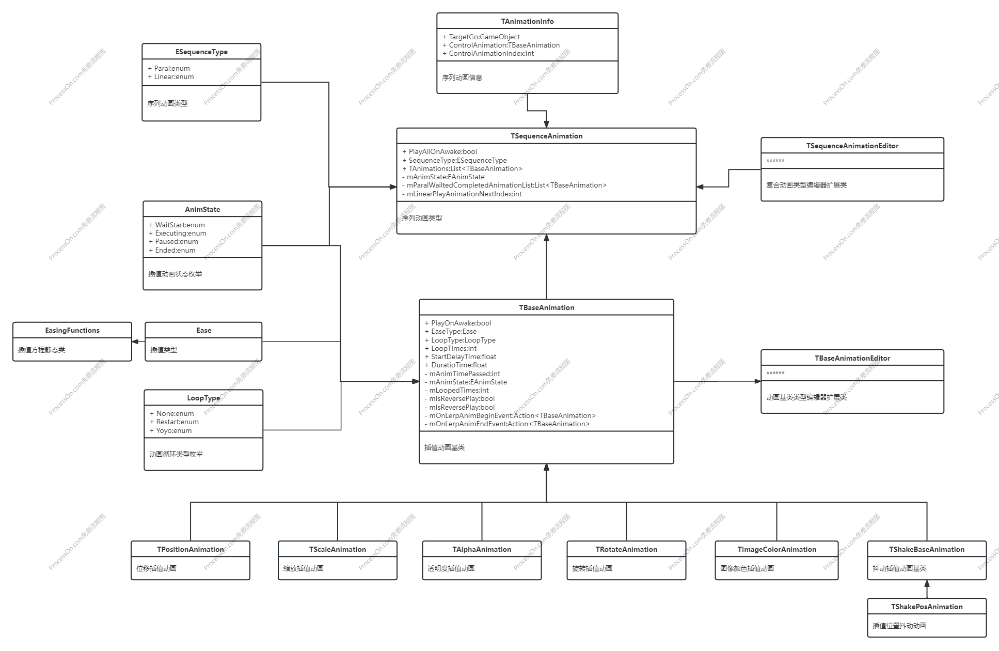
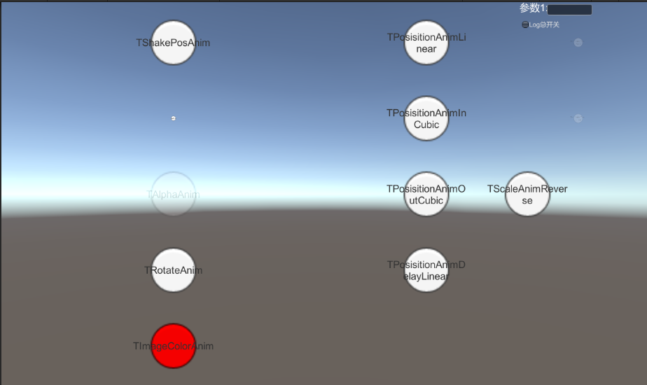

# Ease Component

## 前言

通过学习Dotween的设计和使用，设计并实现一个简陋版的组件式Dotween，方便快速挂载制定程序化动画效果。深入理解数学在插值动画里的运用和实现方式。

## 设计

让我们先看一下Ease Component的UML设计:

- TBaseAnimation.cs

  所有插值动画的基类(抽象网络插值动画的流程以及基础支持),支持是否Awake时自动播放，插值类型，延迟时间，持续时间，是否翻转插值效果等基础设置

- TSequenceAnimation.cs

  序列动画抽象,负责像Dotween的Sequence一样管理一系列TBaseAnimation的整体播放效果(比如线性播放和并发播放)

- TSequenceAnimationInspector.cs

  序列动画的自定义面板，核心是通过SerializeObject和SerializeProperty编写支持Undo的自定义序列动画面板

- EasingFunctions.cs

  Git上找的关于不同插值动画类型的核心函数方程定义,把时间插值比列通过不同的函数方程计算出不同的插值系数，从而实现不同的插值方程式的插值动画效果

- TPositionAnimation.cs, TScaleAnimation.cs, TAlphaAnimation.cs ......

  落实到具体的插值动画类型的实现类

最终效果:

关于Ease的详细方程选择:

感兴趣的朋友自己下载源码。

## Reference

[可视化插值方程](https://easings.net/)